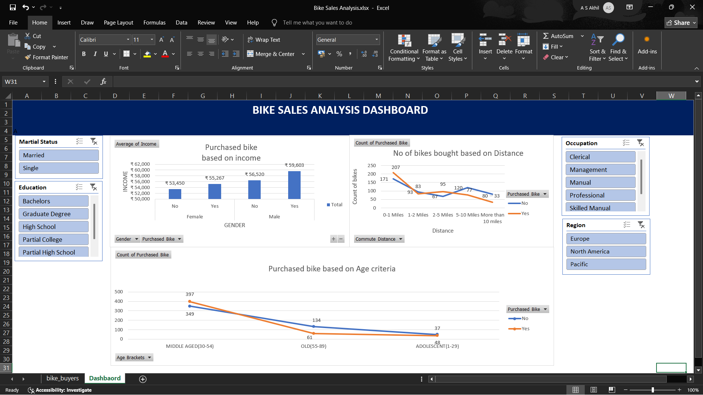

## 📷 Dashboard Preview

# 📊 Data Analytics Portfolio – Akhil

## 🚴 Bike Sales Analysis Dashboard (Excel)

### 📌 Project Overview
This project analyzes bike purchase behavior using Excel.

### 🛠 Tools Used
- Excel

### 📊 Features
- Income vs Purchase Analysis
- Distance vs Purchase Count
- Age-Based Analysis
- Interactive Slicers:
  - Marital Status
  - Education
  - Occupation
  - Region

### 🔎 Key Insights
- Middle-aged customers purchased more bikes.
- Short commute customers showed higher buying tendency.
- Higher income groups were more likely to purchase.

### 🧠 Skills Applied
- Data Cleaning
- Pivot Tables
- Dashboard Design
- Business Insight Extraction
